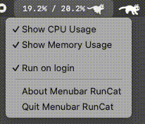

# menubar_runcat

I built an archived version of Run Cat into a `.dmg` file for my personal use since I'm in an environment where I can't use the App Store.

- origin repository (archived): [Kyome22/menubar_runcat](Kyome22/menubar_runcat)
- [App Store Version](https://apps.apple.com/us/app/runcat/id1429033973) - not opensource

## Changes

- Modified Run Cat speed logic
- Added memory usage feature
- Added run on login feature

## Demo

## Download

You can download `.dmg` from [releases](https://github.com/dev-jonghoonpark/menubar_runcat/releases)
